# Modelado Estático y Dinámico de Sistemas


## Introducción

En este capítulo abordaremos dos aspectos fundamentales del análisis y diseño de sistemas de información: el **modelado estático** y el **modelado dinámico**. Ambos enfoques son complementarios y esenciales para comprender y documentar un sistema desde diferentes perspectivas.

El modelado estático nos permite capturar la **estructura** del sistema: qué entidades existen, cómo se relacionan, qué atributos poseen y qué operaciones pueden realizar. Por otro lado, el modelado dinámico nos muestra el **comportamiento** del sistema: cómo interactúan los objetos, cómo fluye la información, cómo cambian los estados y cómo se ejecutan los procesos a lo largo del tiempo.

### Caso de Estudio: Sistema de Gestión de Biblioteca Universitaria (SIBIU)

A lo largo de este tutorial, desarrollaremos un sistema completo de gestión bibliotecaria que permitirá:

- Registro y autenticación de usuarios (estudiantes, profesores, bibliotecarios)
- Búsqueda y consulta del catálogo de libros
- Préstamo y devolución de ejemplares
- Gestión de reservas
- Administración de multas por retraso
- Generación de reportes estadísticos

Este ejemplo nos permitirá explorar todos los diagramas UML necesarios y comprender cómo se interrelacionan.


## PARTE I: MODELADO ESTÁTICO DEL SISTEMA

### 1. Fundamentos del Modelado Estático

El modelado estático se enfoca en representar los **aspectos estructurales** de un sistema, independientemente del tiempo. Captura:

- **Actores**: Entidades externas que interactúan con el sistema
- **Entidades**: Conceptos u objetos del dominio del problema
- **Atributos**: Características de las entidades
- **Relaciones**: Vínculos entre entidades
- **Operaciones**: Comportamientos que las entidades pueden realizar

#### 1.1 Beneficios del Modelado Estático

- Proporciona una visión clara de la estructura del sistema
- Facilita la comunicación entre analistas, desarrolladores y stakeholders
- Sirve como base para el diseño de bases de datos
- Permite identificar inconsistencias tempranas en el análisis
- Documenta el vocabulario del dominio del problema


### 2. Identificación de Actores, Entidades y Relaciones

#### 2.1 Actores del Sistema

Los actores representan roles que interactúan con el sistema. Para SIBIU identificamos:

**Actores Principales:**
- **Estudiante**: Usuario que consulta, reserva y solicita préstamos
- **Profesor**: Usuario con privilegios extendidos (más libros, más tiempo)
- **Bibliotecario**: Administra préstamos, devoluciones y el catálogo
- **Administrador**: Gestiona usuarios y configuración del sistema

**Actores Secundarios:**
- **Sistema de Notificaciones**: Envía recordatorios automáticos
- **Sistema de Pagos**: Procesa pagos de multas

#### 2.2 Entidades Principales

Analizando el dominio del problema, identificamos:

- **Usuario**: Abstracción de personas que usan el sistema
- **Libro**: Obra literaria en el catálogo
- **Ejemplar**: Copia física de un libro
- **Préstamo**: Transacción de préstamo de un ejemplar
- **Reserva**: Solicitud de un libro no disponible
- **Multa**: Penalización por devolución tardía
- **Categoría**: Clasificación de libros (género, materia)

#### 2.3 Relaciones Identificadas

- Un Usuario puede tener múltiples Préstamos
- Un Libro tiene uno o más Ejemplares
- Un Ejemplar puede tener múltiples Préstamos (histórico)
- Un Usuario puede realizar múltiples Reservas
- Un Préstamo puede generar una Multa
- Un Libro pertenece a una o más Categorías

### 3. Diagrama de Casos de Uso

Los **casos de uso** describen las funcionalidades del sistema desde la perspectiva del usuario. Representan **qué** puede hacer un actor con el sistema, sin entrar en detalles de **cómo** se implementa.

#### 3.1 Características del Diagrama de Casos de Uso

- **Actores**: Representados con iconos de persona o estereotipos
- **Casos de Uso**: Elipses que describen funcionalidades
- **Relaciones**:
  - **Asociación**: Línea simple entre actor y caso de uso
  - **Include**: Dependencia obligatoria (<<include>>)
  - **Extend**: Comportamiento opcional (<<extend>>)
  - **Generalización**: Herencia entre actores o casos de uso

#### 3.2 Diagrama de Casos de Uso para SIBIU

<div style="max-width: 100%; overflow-x: auto; text-align: center;">

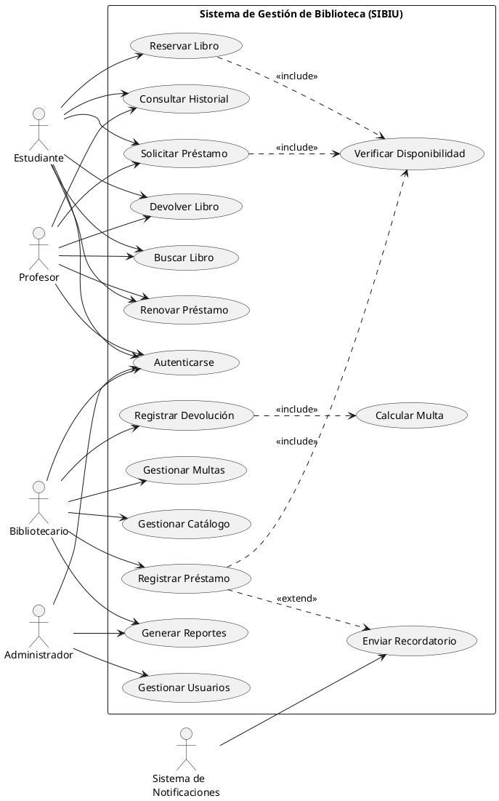

</div>

#### 3.3 Descripción de Casos de Uso Principales

**UC4: Solicitar Préstamo**

- **Actor Principal**: Estudiante, Profesor
- **Precondiciones**: Usuario autenticado, libro disponible
- **Flujo Principal**:
  1. Usuario busca el libro deseado
  2. Sistema verifica disponibilidad
  3. Usuario solicita préstamo
  4. Sistema verifica límites del usuario
  5. Sistema registra el préstamo
  6. Sistema actualiza estado del ejemplar
- **Postcondiciones**: Ejemplar marcado como prestado

**UC9: Registrar Devolución**

- **Actor Principal**: Bibliotecario
- **Precondiciones**: Préstamo activo existe
- **Flujo Principal**:
  1. Bibliotecario escanea código del libro
  2. Sistema identifica el préstamo activo
  3. Sistema calcula si hay retraso
  4. Si hay retraso, sistema calcula multa
  5. Sistema registra la devolución
  6. Sistema actualiza estado del ejemplar
- **Postcondiciones**: Ejemplar disponible, multa registrada si aplica


### 4. Diagrama de Clases

El **diagrama de clases** es el más importante del modelado estático. Representa la estructura de clases del sistema y sus relaciones.

#### 4.1 Elementos del Diagrama de Clases

**Estructura de una Clase:**

<div style="max-width: 100%; overflow-x: auto; text-align: center;">

```
┌─────────────────┐
│  NombreClase    │  ← Nombre
├─────────────────┤
│ - atributo1     │  ← Atributos (- privado, + público, # protegido)
│ + atributo2     │
├─────────────────┤
│ + método1()     │  ← Operaciones/Métodos
│ - método2()     │
└─────────────────┘
```

</div>

**Tipos de Relaciones:**

- **Asociación**: Relación estructural entre clases (línea simple)
- **Agregación**: Relación "tiene un" débil (rombo vacío)
- **Composición**: Relación "tiene un" fuerte (rombo lleno)
- **Herencia/Generalización**: Relación "es un" (flecha triangular)
- **Dependencia**: Uso temporal (flecha punteada)
- **Realización**: Implementación de interfaz (flecha punteada triangular)

**Multiplicidad:**
- `1` : Exactamente uno
- `0..1` : Cero o uno
- `*` : Cero o muchos
- `1..*` : Uno o muchos
- `n..m` : Entre n y m

#### 4.2 Diagrama de Clases para SIBIU
<div style="max-width: 100%; overflow-x: auto; text-align: center;">

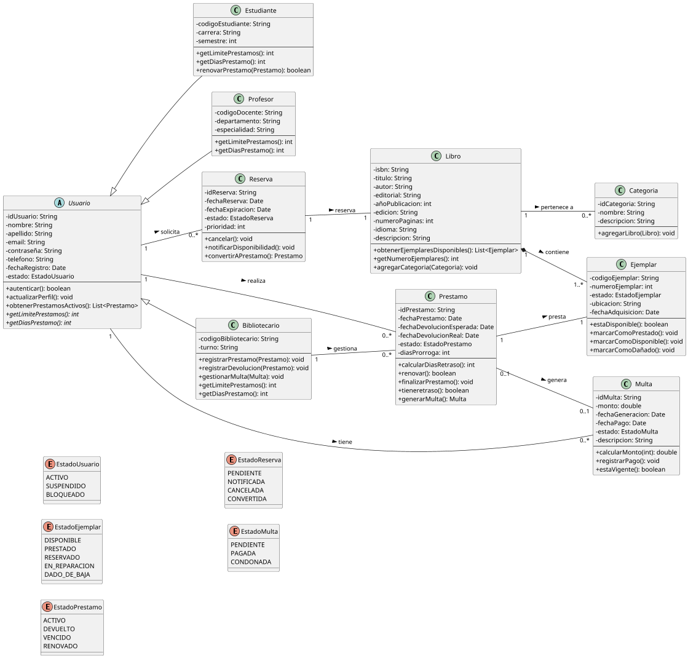

</div>

#### 4.3 Análisis del Diagrama de Clases

**Patrones de Diseño Identificados:**

1. **Herencia**: La clase abstracta `Usuario` define comportamiento común para Estudiante, Profesor y Bibliotecario, aplicando el principio de polimorfismo.

2. **Composición**: La relación entre `Libro` y `Ejemplar` es de composición fuerte (rombo negro), indicando que los ejemplares no tienen sentido sin el libro.

3. **Enumeraciones**: Los estados se modelan como enumeraciones para garantizar valores válidos y facilitar el mantenimiento.

**Decisiones de Diseño:**

- `getLimitePrestamos()` y `getDiasPrestamo()` son métodos abstractos que cada tipo de usuario implementa según sus privilegios
- `Prestamo` es una clase asociativa entre `Usuario` y `Ejemplar`
- `Multa` se genera automáticamente cuando hay retraso en la devolución

### 5. Diagrama de Objetos

El **diagrama de objetos** muestra instancias concretas de clases en un momento específico. Es útil para:

- Validar el diseño del diagrama de clases
- Ilustrar escenarios específicos
- Documentar casos de prueba
- Clarificar relaciones complejas

#### 5.1 Diagrama de Objetos - Escenario de Préstamo

<div style="max-width: 100%; overflow-x: auto; text-align: center;">

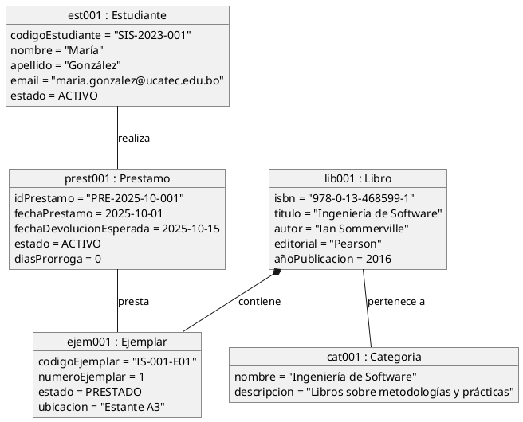

</div>

Este diagrama muestra una instancia concreta donde la estudiante María González tiene un préstamo activo del libro "Ingeniería de Software".


### 6. Modelo Entidad-Relación y Conexión con Bases de Datos

#### 6.1 Del Modelo Conceptual al Lógico

El diagrama de clases UML se puede transformar directamente en un esquema de base de datos relacional:

**Reglas de Transformación:**

1. **Clase** → **Tabla**
2. **Atributo** → **Columna**
3. **Asociación 1:N** → **Clave foránea** en la tabla del lado "N"
4. **Asociación N:M** → **Tabla intermedia** con dos claves foráneas
5. **Herencia** → Puede implementarse con:
   - Tabla única con discriminador
   - Tabla por clase concreta
   - Tabla por jerarquía

#### 6.2 Diseño de Base de Datos para SIBIU (SQL)

```sql
-- Tabla Usuario (tabla base para herencia)
CREATE TABLE Usuario (
    id_usuario VARCHAR(50) PRIMARY KEY,
    tipo_usuario VARCHAR(20) NOT NULL, -- Discriminador
    nombre VARCHAR(100) NOT NULL,
    apellido VARCHAR(100) NOT NULL,
    email VARCHAR(150) UNIQUE NOT NULL,
    contraseña VARCHAR(255) NOT NULL,
    telefono VARCHAR(20),
    fecha_registro DATE NOT NULL,
    estado VARCHAR(20) NOT NULL,
    -- Campos específicos opcionales
    codigo_estudiante VARCHAR(50),
    carrera VARCHAR(100),
    semestre INT,
    codigo_docente VARCHAR(50),
    departamento VARCHAR(100),
    especialidad VARCHAR(100),
    codigo_bibliotecario VARCHAR(50),
    turno VARCHAR(20),
    CHECK (tipo_usuario IN ('ESTUDIANTE', 'PROFESOR', 'BIBLIOTECARIO'))
);

-- Tabla Libro
CREATE TABLE Libro (
    isbn VARCHAR(20) PRIMARY KEY,
    titulo VARCHAR(200) NOT NULL,
    autor VARCHAR(200) NOT NULL,
    editorial VARCHAR(100),
    año_publicacion INT,
    edicion VARCHAR(50),
    numero_paginas INT,
    idioma VARCHAR(50),
    descripcion TEXT,
    INDEX idx_titulo (titulo),
    INDEX idx_autor (autor)
);

-- Tabla Ejemplar
CREATE TABLE Ejemplar (
    codigo_ejemplar VARCHAR(50) PRIMARY KEY,
    isbn VARCHAR(20) NOT NULL,
    numero_ejemplar INT NOT NULL,
    estado VARCHAR(30) NOT NULL,
    ubicacion VARCHAR(100),
    fecha_adquisicion DATE,
    FOREIGN KEY (isbn) REFERENCES Libro(isbn) ON DELETE CASCADE,
    CHECK (estado IN ('DISPONIBLE', 'PRESTADO', 'RESERVADO', 'EN_REPARACION', 'DADO_DE_BAJA'))
);

-- Tabla Prestamo
CREATE TABLE Prestamo (
    id_prestamo VARCHAR(50) PRIMARY KEY,
    id_usuario VARCHAR(50) NOT NULL,
    codigo_ejemplar VARCHAR(50) NOT NULL,
    id_bibliotecario VARCHAR(50),
    fecha_prestamo DATE NOT NULL,
    fecha_devolucion_esperada DATE NOT NULL,
    fecha_devolucion_real DATE,
    estado VARCHAR(20) NOT NULL,
    dias_prorroga INT DEFAULT 0,
    FOREIGN KEY (id_usuario) REFERENCES Usuario(id_usuario),
    FOREIGN KEY (codigo_ejemplar) REFERENCES Ejemplar(codigo_ejemplar),
    FOREIGN KEY (id_bibliotecario) REFERENCES Usuario(id_usuario),
    CHECK (estado IN ('ACTIVO', 'DEVUELTO', 'VENCIDO', 'RENOVADO'))
);

-- Tabla Reserva
CREATE TABLE Reserva (
    id_reserva VARCHAR(50) PRIMARY KEY,
    id_usuario VARCHAR(50) NOT NULL,
    isbn VARCHAR(20) NOT NULL,
    fecha_reserva DATE NOT NULL,
    fecha_expiracion DATE NOT NULL,
    estado VARCHAR(20) NOT NULL,
    prioridad INT DEFAULT 0,
    FOREIGN KEY (id_usuario) REFERENCES Usuario(id_usuario),
    FOREIGN KEY (isbn) REFERENCES Libro(isbn),
    CHECK (estado IN ('PENDIENTE', 'NOTIFICADA', 'CANCELADA', 'CONVERTIDA'))
);

-- Tabla Multa
CREATE TABLE Multa (
    id_multa VARCHAR(50) PRIMARY KEY,
    id_prestamo VARCHAR(50) NOT NULL,
    id_usuario VARCHAR(50) NOT NULL,
    monto DECIMAL(10,2) NOT NULL,
    fecha_generacion DATE NOT NULL,
    fecha_pago DATE,
    estado VARCHAR(20) NOT NULL,
    descripcion VARCHAR(255),
    FOREIGN KEY (id_prestamo) REFERENCES Prestamo(id_prestamo),
    FOREIGN KEY (id_usuario) REFERENCES Usuario(id_usuario),
    CHECK (estado IN ('PENDIENTE', 'PAGADA', 'CONDONADA'))
);

-- Tabla Categoria
CREATE TABLE Categoria (
    id_categoria VARCHAR(50) PRIMARY KEY,
    nombre VARCHAR(100) NOT NULL UNIQUE,
    descripcion TEXT
);

-- Tabla intermedia Libro_Categoria (N:M)
CREATE TABLE Libro_Categoria (
    isbn VARCHAR(20),
    id_categoria VARCHAR(50),
    PRIMARY KEY (isbn, id_categoria),
    FOREIGN KEY (isbn) REFERENCES Libro(isbn) ON DELETE CASCADE,
    FOREIGN KEY (id_categoria) REFERENCES Categoria(id_categoria) ON DELETE CASCADE
);
```

#### 6.3 Consideraciones para NoSQL

Para sistemas con alta escalabilidad, podríamos usar **MongoDB** (base de datos orientada a documentos):

```javascript
// Colección: usuarios
{
  "_id": "est001",
  "tipo": "estudiante",
  "nombre": "María González",
  "email": "maria.gonzalez@ucatec.edu.bo",
  "carrera": "Ingeniería de Sistemas",
  "prestamosActivos": [
    {
      "idPrestamo": "PRE-2025-10-001",
      "codigoEjemplar": "IS-001-E01",
      "fechaPrestamo": ISODate("2025-10-01"),
      "fechaDevolucion": ISODate("2025-10-15")
    }
  ],
  "historialPrestamos": [...],
  "multas": [...]
}

// Colección: libros
{
  "_id": "978-0-13-468599-1",
  "titulo": "Ingeniería de Software",
  "autor": "Ian Sommerville",
  "categorias": ["Ingeniería de Software", "Metodologías"],
  "ejemplares": [
    {
      "codigo": "IS-001-E01",
      "estado": "prestado",
      "ubicacion": "Estante A3"
    }
  ]
}
```

**Ventajas de NoSQL para este sistema:**
- Mayor flexibilidad para diferentes tipos de usuarios
- Mejor rendimiento en consultas de catálogo
- Fácil escalabilidad horizontal
- Manejo natural de datos jerárquicos

**Desventajas:**
- Menor garantía de consistencia transaccional
- Posible duplicación de datos
- Complejidad en consultas relacionales

## PARTE II: MODELADO DINÁMICO Y COMPORTAMIENTO DEL SISTEMA

### 7. Fundamentos del Modelado Dinámico

Mientras el modelado estático captura la estructura, el **modelado dinámico** describe el comportamiento del sistema a lo largo del tiempo. Responde a preguntas como:

- ¿Cómo interactúan los objetos para cumplir una funcionalidad?
- ¿En qué secuencia se invocan los métodos?
- ¿Cómo cambia el estado de un objeto?
- ¿Qué procesos se ejecutan y en qué orden?

#### 7.1 Tipos de Diagramas Dinámicos

**Orientados a Interacción:**
- Diagrama de Secuencia
- Diagrama de Comunicación

**Orientados a Comportamiento:**
- Diagrama de Actividades
- Diagrama de Estados
- Diagrama BPMN (Business Process Model and Notation)

### 8. Diagrama de Secuencia

El **diagrama de secuencia** muestra la interacción entre objetos a través del tiempo, enfatizando el **orden temporal** de los mensajes.

#### 8.1 Elementos del Diagrama de Secuencia

- **Actores/Objetos**: Representados en la parte superior
- **Línea de vida**: Línea vertical punteada que representa la existencia del objeto
- **Activación**: Rectángulo sobre la línea de vida (objeto activo)
- **Mensajes**: Flechas entre líneas de vida
  - **Síncrono**: Flecha sólida (espera respuesta)
  - **Asíncrono**: Flecha abierta (no espera respuesta)
  - **Retorno**: Flecha punteada
- **Fragmentos**: alt, opt, loop, par (condiciones, opciones, bucles, paralelismo)

#### 8.2 Secuencia: Solicitar Préstamo de Libro

<div style="max-width: 100%; overflow-x: auto; text-align: center;">

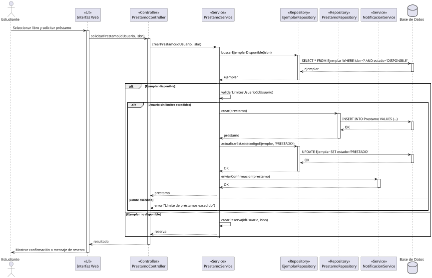

</div>

#### 8.3 Análisis del Diagrama de Secuencia

**Elementos destacados:**

1. **Fragmento ALT (alternativa)**: Muestra decisiones condicionales
   - Si hay ejemplar disponible vs. no disponible
   - Si el usuario puede solicitar más préstamos vs. límite excedido

2. **Activaciones**: Los rectángulos muestran cuándo cada objeto está procesando

3. **Capas de la Arquitectura**:
   - **Presentación**: Interfaz Web
   - **Controlador**: PrestamoController
   - **Lógica de Negocio**: PrestamoService
   - **Acceso a Datos**: Repositories
   - **Persistencia**: Base de Datos

4. **Patrón de Diseño**: Se observa el patrón **Service-Repository**, común en arquitecturas limpias y DDD (Domain-Driven Design)

#### 8.4 Secuencia: Devolver Libro con Cálculo de Multa

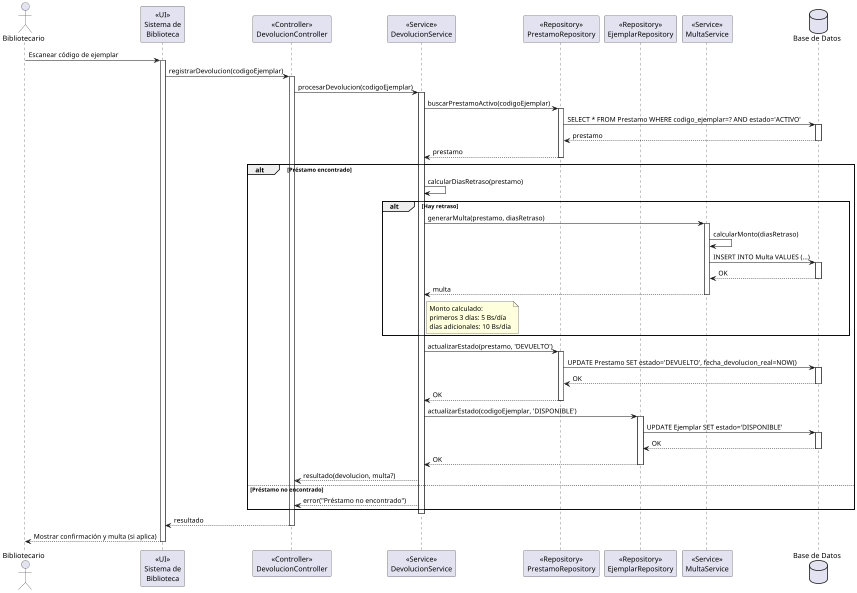


### 9. Diagrama de Comunicación

El **diagrama de comunicación** (antes llamado diagrama de colaboración) muestra las mismas interacciones que el diagrama de secuencia, pero enfatiza la **estructura** y las **relaciones** entre objetos.

#### 9.1 Características del Diagrama de Comunicación

- Los mensajes se numeran secuencialmente (1, 2, 3, ...)
- Los mensajes anidados usan notación decimal (1.1, 1.2, 2.1, ...)
- Muestra mejor las relaciones estructurales entre objetos
- Útil cuando el espacio vertical es limitado

#### 9.2 Comunicación: Renovar Préstamo

```plantuml
@startuml

'left to right direction
scale 0.45

object ":Estudiante" as est
object ":InterfazWeb" as ui
object ":PrestamoController" as ctrl
object ":PrestamoService" as svc
object ":PrestamoRepository" as repo
object ":Prestamo" as prest

est -> ui : 1: renovarPrestamo(idPrestamo)
ui -> ctrl : 2: renovarPrestamo(idPrestamo, idUsuario)
ctrl -> svc : 3: renovar(idPrestamo, idUsuario)
svc -> repo : 4: buscarPorId(idPrestamo)
repo --> svc : 5: prestamo
svc -> prest : 6: validarRenovacion()
prest --> svc : 7: esRenovable
svc -> prest : 8: renovar()
prest -> prest : 8.1: calcularNuevaFecha()
prest -> prest : 8.2: incrementarDiasProrroga()
svc -> repo : 9: actualizar(prestamo)
repo --> svc : 10: OK
svc --> ctrl : 11: prestamoRenovado
ctrl --> ui : 12: resultado
ui --> est : 13: mostrarConfirmacion()

@enduml
```

#### 9.3 Comparación: Secuencia vs. Comunicación

| Aspecto | Diagrama de Secuencia | Diagrama de Comunicación |
|---------|----------------------|-------------------------|
| **Énfasis** | Orden temporal | Relaciones estructurales |
| **Layout** | Vertical (tiempo fluye hacia abajo) | Libre (espacial) |
| **Mejor para** | Procesos complejos con muchos pasos | Relaciones entre pocos objetos |
| **Visibilidad temporal** | Excelente | Debe inferirse de números |
| **Visibilidad estructural** | Debe inferirse | Excelente |

**Recomendación**: Use diagramas de secuencia para la mayoría de los casos. Use diagramas de comunicación cuando la estructura de las relaciones sea más importante que el tiempo.


### 10. Diagrama de Actividades

El **diagrama de actividades** modela flujos de trabajo, procesos de negocio y algoritmos. Es similar a un diagrama de flujo pero con mayor expresividad.

#### 10.1 Elementos del Diagrama de Actividades

- **Nodo Inicial**: Círculo negro relleno
- **Nodo Final**: Círculo negro con borde
- **Actividad**: Rectángulo con esquinas redondeadas
- **Decisión**: Rombo
- **Fork/Join**: Barra horizontal (paralelismo)
- **Swimlanes**: Divisiones para mostrar responsabilidades

#### 10.2 Actividades: Proceso Completo de Préstamo

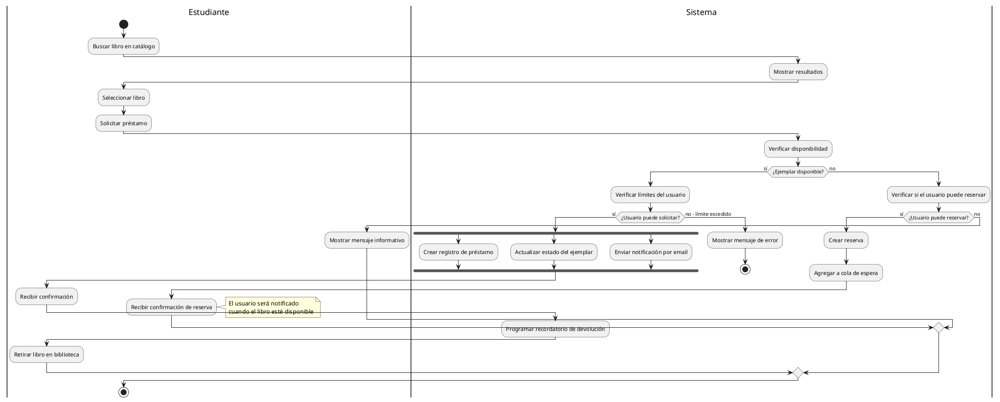

#### 10.3 Actividades: Proceso de Gestión de Multas

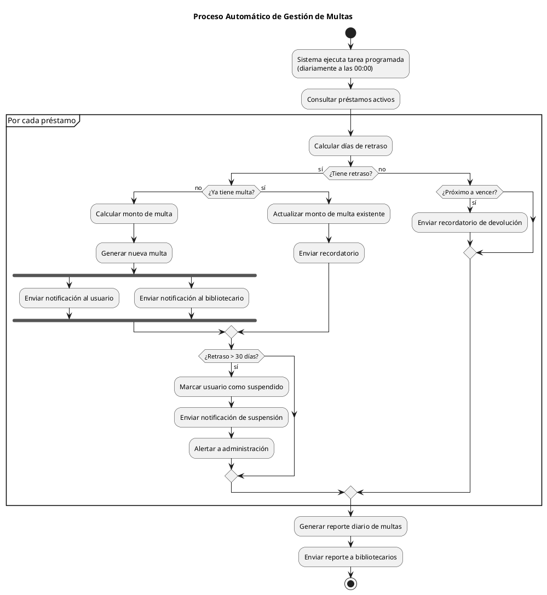

#### 10.4 Análisis del Diagrama de Actividades

**Ventajas del uso de swimlanes:**
- Clarifica responsabilidades entre actores
- Muestra transferencias de control
- Facilita la identificación de cuellos de botella

**Paralelismo (fork/join):**
- El sistema puede ejecutar múltiples tareas simultáneamente
- Mejora el rendimiento
- Reduce el tiempo de respuesta percibido


### 11. Diagrama de Estados

El **diagrama de estados** (o máquina de estados) modela el ciclo de vida de un objeto, mostrando sus estados posibles y las transiciones entre ellos.

#### 11.1 Elementos del Diagrama de Estados

- **Estado**: Rectángulo con esquinas redondeadas
- **Estado Inicial**: Círculo negro
- **Estado Final**: Círculo negro con borde
- **Transición**: Flecha con etiqueta `evento [guardia] / acción`
- **Estado Compuesto**: Estado que contiene subestados

#### 11.2 Estados: Ciclo de Vida de un Préstamo

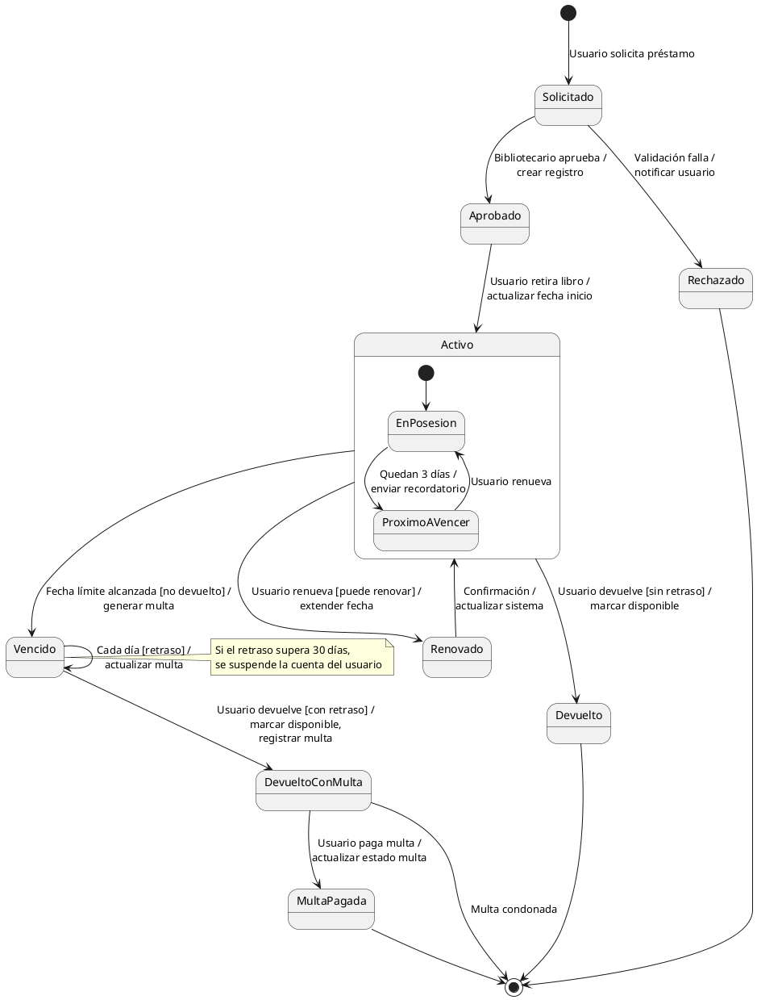

#### 11.3 Estados: Ciclo de Vida de un Ejemplar

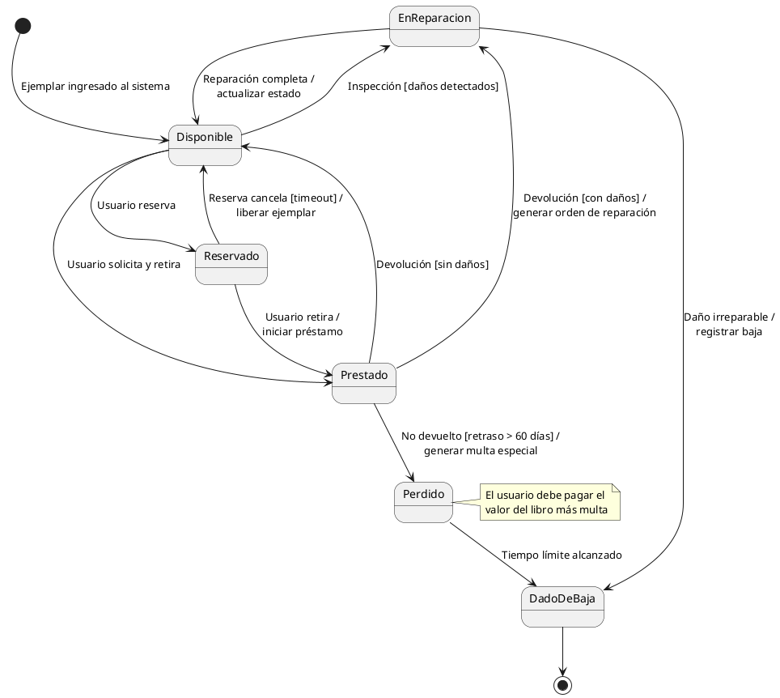

#### 11.4 Aplicaciones del Diagrama de Estados

**Utilidad en el desarrollo:**

1. **Validación de negocio**: Define estados válidos y transiciones permitidas
2. **Implementación**: Se traduce directamente al patrón State
3. **Testing**: Cada transición es un caso de prueba
4. **Documentación**: Explica el ciclo de vida de forma visual

**Implementación en código (ejemplo):**

```java
public enum EstadoPrestamo {
    SOLICITADO {
        @Override
        public EstadoPrestamo aprobar() {
            return APROBADO;
        }
    },
    APROBADO {
        @Override
        public EstadoPrestamo activar() {
            return ACTIVO;
        }
    },
    ACTIVO {
        @Override
        public EstadoPrestamo renovar() {
            return RENOVADO;
        }
        @Override
        public EstadoPrestamo devolver() {
            return DEVUELTO;
        }
        @Override
        public EstadoPrestamo vencer() {
            return VENCIDO;
        }
    },
    // ... otros estados
    
    // Transiciones por defecto (lanza excepción)
    public EstadoPrestamo aprobar() {
        throw new IllegalStateException("Transición no permitida");
    }
    // ... otros métodos de transición
}
```


### 12. Introducción a BPMN (Business Process Model and Notation)

**BPMN** es un estándar de notación para modelar procesos de negocio. Aunque técnicamente no es UML, es ampliamente usado en análisis de sistemas.

#### 12.1 Diferencias entre BPMN y Diagramas de Actividades UML

| Aspecto | BPMN | Diagrama de Actividades UML |
|---------|------|----------------------------|
| **Propósito** | Procesos de negocio | Flujos de trabajo técnicos |
| **Audiencia** | Analistas de negocio, stakeholders | Desarrolladores, arquitectos |
| **Detalle** | Nivel de negocio | Nivel técnico |
| **Eventos** | Ricos en eventos y excepciones | Más simple |
| **Complejidad** | Mayor riqueza notacional | Más simple y directo |

#### 12.2 Proceso BPMN: Gestión Integral de Biblioteca

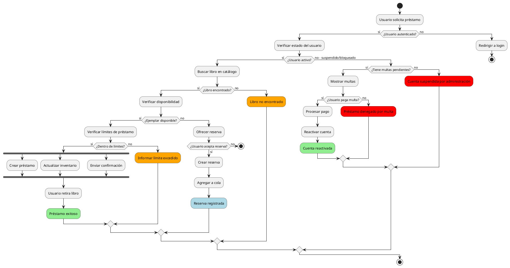

#### 12.3 Eventos en BPMN

**Tipos de eventos comunes:**

- **Eventos de Inicio**: Disparan el proceso
  - Mensaje recibido
  - Temporizador
  - Condición cumplida

- **Eventos Intermedios**: Ocurren durante el proceso
  - Espera de tiempo
  - Recepción de señal
  - Error capturado

- **Eventos de Fin**: Terminan el proceso
  - Fin normal
  - Fin con error
  - Fin con mensaje


### 13. Integración: Del Modelado Estático al Dinámico

#### 13.1 Trazabilidad entre Modelos

La trazabilidad asegura consistencia entre diferentes vistas:

```
Casos de Uso → Diagramas de Secuencia
             ↓
Diagrama de Clases ← → Diagramas de Objetos
             ↓
Diagrama de Estados (objetos clave)
             ↓
Diagramas de Actividades (procesos)
             ↓
Implementación
```

#### 13.2 Matriz de Trazabilidad (ejemplo)

| Caso de Uso | Clases Involucradas | Diagrama de Secuencia | Diagrama de Estados |
|-------------|---------------------|----------------------|-------------------|
| UC4: Solicitar Préstamo | Usuario, Libro, Ejemplar, Prestamo | Seq-Prestamo | Estado-Prestamo, Estado-Ejemplar |
| UC9: Registrar Devolución | Prestamo, Ejemplar, Multa | Seq-Devolucion | Estado-Prestamo, Estado-Ejemplar |
| UC3: Reservar Libro | Usuario, Libro, Reserva | Seq-Reserva | Estado-Reserva |

#### 13.3 Validación de Consistencia

**Checklist de consistencia:**

✓ Cada mensaje en un diagrama de secuencia corresponde a un método en el diagrama de clases
✓ Los estados en un diagrama de estados coinciden con valores de atributos en el diagrama de clases
✓ Los actores en casos de uso aparecen en diagramas de secuencia
✓ Las actividades en diagramas de actividades corresponden a operaciones de clases
✓ Las transiciones en diagramas de estados están respaldadas por métodos


### 14. Ejemplo Integrador Completo: Flujo de Reserva y Notificación

Veamos un ejemplo que integra múltiples diagramas para un proceso completo.

#### 14.1 Caso de Uso: Gestionar Reserva

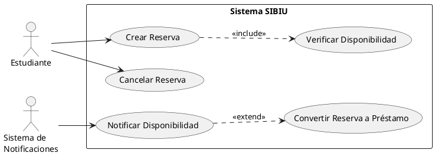

#### 14.2 Diagrama de Secuencia: Proceso de Reserva y Conversión

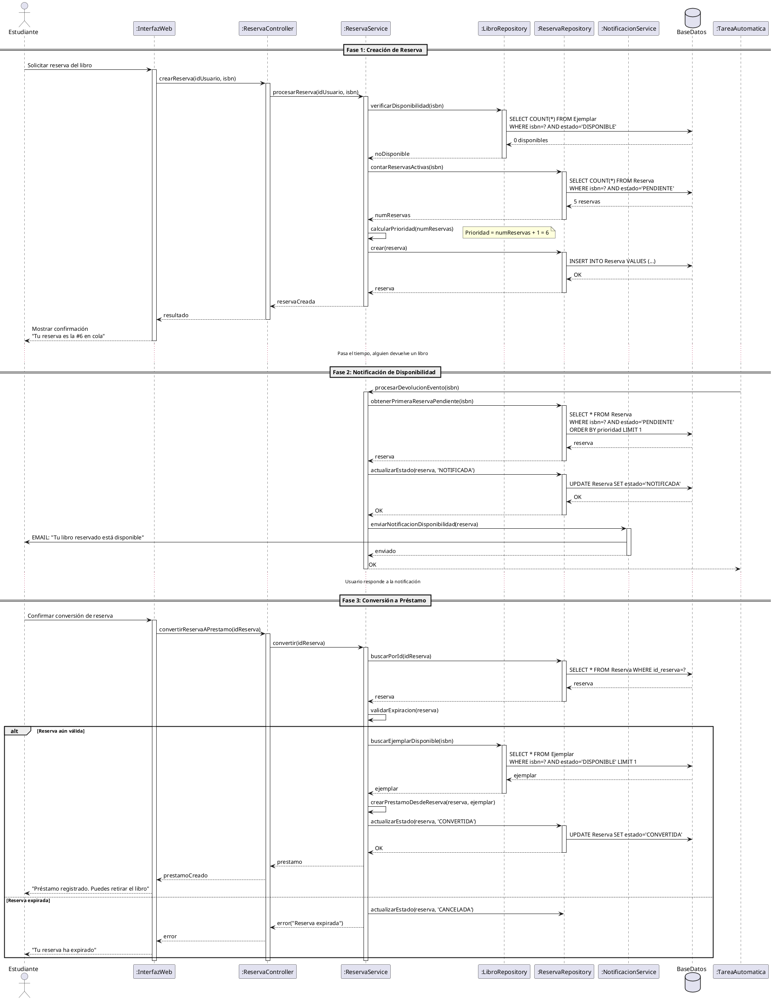

#### 14.3 Diagrama de Estados: Reserva

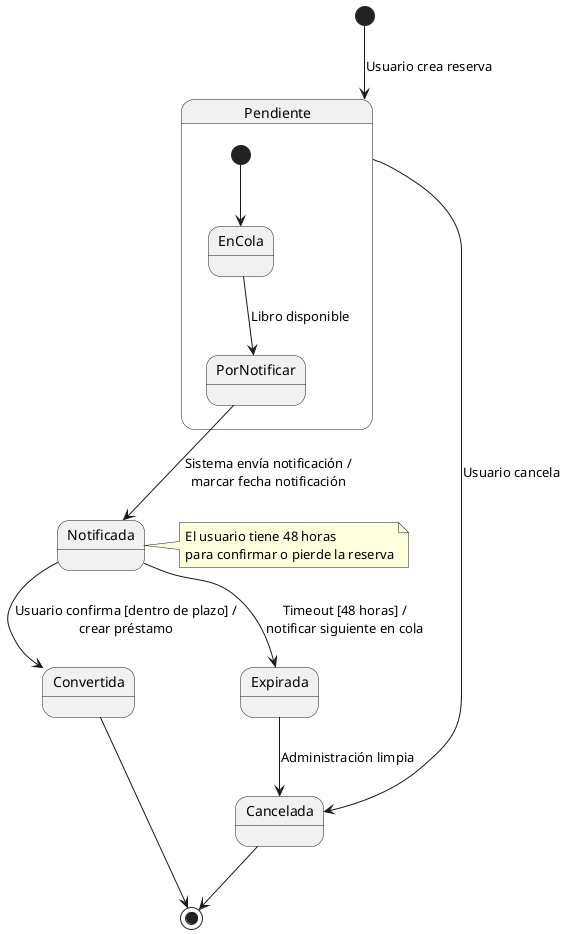

#### 14.4 Diagrama de Actividades: Proceso de Cola de Reservas

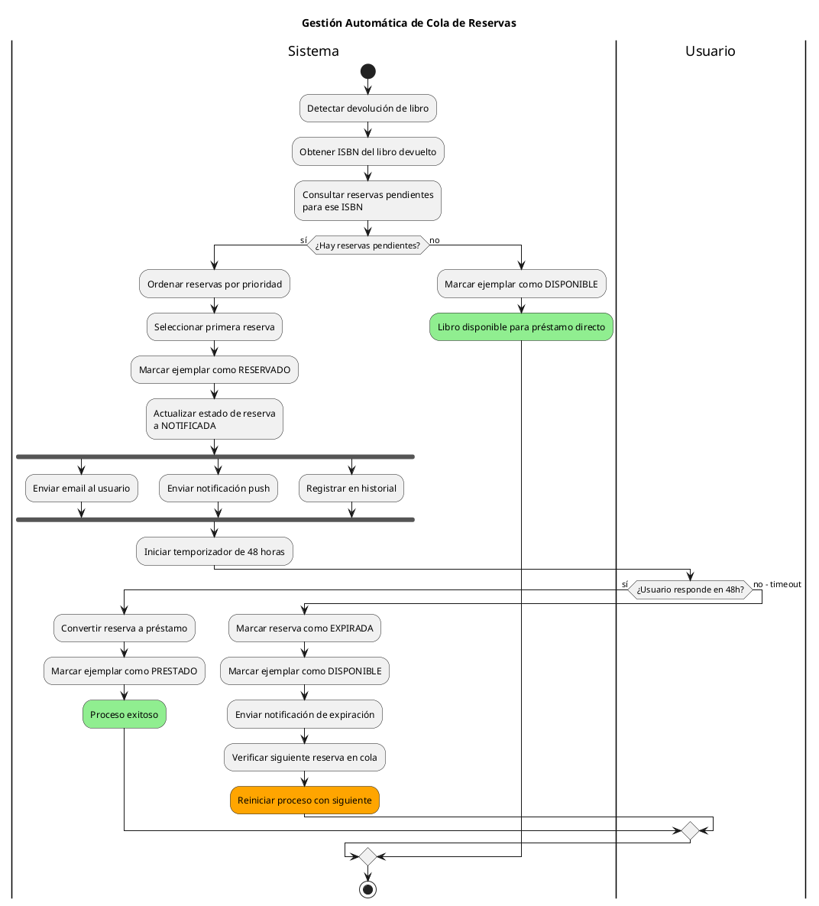


### 15. Herramientas y Buenas Prácticas

#### 15.1 PlantUML: Guía Rápida

**Instalación y uso:**

```bash
# Instalación con npm
npm install -g node-plantuml

# Generar imagen desde archivo
plantuml diagrama.puml

# Generar en formato específico
plantuml -tpng diagrama.puml
plantuml -tsvg diagrama.puml
```

**Integración con editores:**

- **VS Code**: Extensión "PlantUML"
- **Online**: [www.plantuml.com/plantuml](http://www.plantuml.com/plantuml)

**Configuración de estilo personalizado:**


<pre>


@startuml
skinparam backgroundColor #FFFFFF
skinparam classBackgroundColor #E8F4F8
skinparam classBorderColor #2980B9
skinparam classFontSize 12
skinparam classFontName Arial
skinparam arrowColor #555555
skinparam sequenceMessageAlign center

' Tu diagrama aquí
@enduml

</pre>


#### 15.2 Buenas Prácticas de Modelado

**Principios generales:**

1. **Simplicidad**: El diagrama debe ser comprensible
   - Evite sobrecargar un solo diagrama
   - Divida en múltiples vistas si es necesario

2. **Consistencia**: Mantenga consistencia entre diagramas
   - Use los mismos nombres de clases/métodos
   - Mantenga trazabilidad

3. **Propósito claro**: Cada diagrama debe tener un objetivo
   - No modele por modelar
   - Cada diagrama debe comunicar algo específico

4. **Nivel de detalle apropiado**: Ajuste el detalle a la audiencia
   - Diagramas de alto nivel para stakeholders
   - Diagramas detallados para desarrolladores

**Para Diagramas de Clases:**

- Use nombres significativos en español (o inglés consistentemente)
- Especifique multiplicidades en todas las asociaciones
- Marque claramente la visibilidad (+, -, #)
- Use estereotipos cuando agreguen valor (<<interface>>, <<abstract>>)
- Agrupe clases relacionadas visualmente

**Para Diagramas de Secuencia:**

- Limite a 7-10 objetos por diagrama
- Use fragmentos (alt, opt, loop) para claridad
- Documente condiciones en guardias
- Nombre los mensajes de retorno cuando agreguen valor

**Para Diagramas de Estados:**

- Asegúrese de que todos los estados sean alcanzables
- Defina claramente eventos y acciones
- Use estados compuestos para simplificar
- Documente estados finales

**Para Diagramas de Actividades:**

- Use swimlanes para clarificar responsabilidades
- Limite el anidamiento de decisiones (máximo 3 niveles)
- Documente condiciones de decisión
- Use notas para información adicional importante

#### 15.3 Errores Comunes a Evitar

**Error 1: Diagramas demasiado complejos**
```
❌ Mal: Un diagrama de clases con 50 clases
✓  Bien: Múltiples diagramas enfocados en subsistemas
```

**Error 2: Inconsistencia de nombres**
```
❌ Mal: Usuario en un diagrama, User en otro, Usr en otro
✓  Bien: Usuario consistentemente en todos los diagramas
```

**Error 3: Falta de multiplicidad**
```
❌ Mal: Usuario -- Prestamo (sin multiplicidad)
✓  Bien: Usuario "1" -- "0..*" Prestamo
```

**Error 4: Mezclar niveles de abstracción**
```
❌ Mal: Métodos abstractos y métodos SQL en la misma clase
✓  Bien: Separar capas lógica/persistencia
```

**Error 5: Olvidar la audiencia**
```
❌ Mal: Mostrar implementación técnica a stakeholders de negocio
✓  Bien: Ajustar detalle según la audiencia
```


### 16. Ejercicios Prácticos

#### Ejercicio 1: Modelado Estático

**Contexto**: Sistema de Gestión de Restaurante

Desarrolle:
1. Diagrama de casos de uso (mínimo 8 casos de uso)
2. Diagrama de clases completo (mínimo 10 clases)
3. Diagrama de objetos para un escenario de reserva de mesa

**Actores sugeridos**: Cliente, Mesero, Cocinero, Cajero, Administrador

**Funcionalidades sugeridas**: Hacer reserva, ordenar comida, preparar plato, procesar pago, gestionar inventario

#### Ejercicio 2: Modelado Dinámico

Usando el sistema del Ejercicio 1, desarrolle:
1. Diagrama de secuencia para "Procesar Orden Completa"
2. Diagrama de estados para "Orden"
3. Diagrama de actividades para "Proceso de Atención al Cliente"

#### Ejercicio 3: Integración

Seleccione un caso de uso del sistema SIBIU (biblioteca) no cubierto en este tutorial y desarrolle:
1. Descripción textual del caso de uso
2. Diagrama de secuencia
3. Diagrama de estados (si aplica)
4. Clases necesarias en diagrama de clases

**Casos de uso sugeridos**:
- Búsqueda avanzada de libros
- Generación de reporte estadístico
- Proceso de adquisición de nuevos libros
- Gestión de categorías y etiquetas

#### Ejercicio 4: Análisis de Inconsistencias

Se proporciona el siguiente diagrama de clases simplificado:

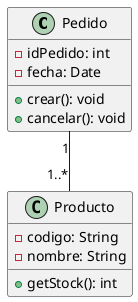

Y el siguiente diagrama de secuencia:

```
Cliente -> Sistema: crearPedido(productos[], cantidad[])
Sistema -> Pedido: new Pedido()
Sistema -> LineaPedido: agregarProducto(producto, cantidad)
Sistema -> Producto: descontarStock(cantidad)
```

**Preguntas:**
1. ¿Qué inconsistencias hay entre ambos diagramas?
2. ¿Qué clase falta en el diagrama de clases?
3. ¿Cómo corregiría el diagrama de clases?
4. ¿Falta alguna verificación en el diagrama de secuencia?


### 17. Consideraciones para Sistemas Modernos

#### 17.1 Modelado de Microservicios

Los microservicios requieren énfasis en:

**Contextos Delimitados (Bounded Contexts)**:
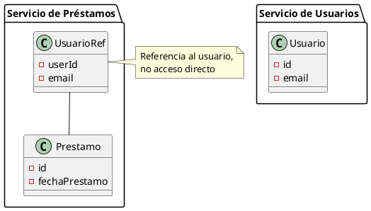

**Comunicación Asíncrona**:
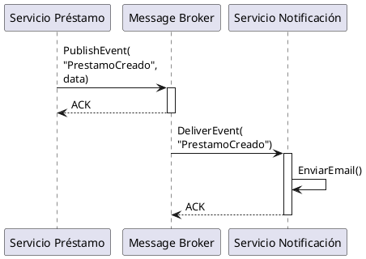

#### 17.2 Modelado de Sistemas Cloud-Native

**Patrones importantes:**

- **Resiliencia**: Circuit Breaker, Retry, Timeout
- **Escalabilidad**: Load Balancing, Auto-scaling
- **Observabilidad**: Logging, Monitoring, Tracing

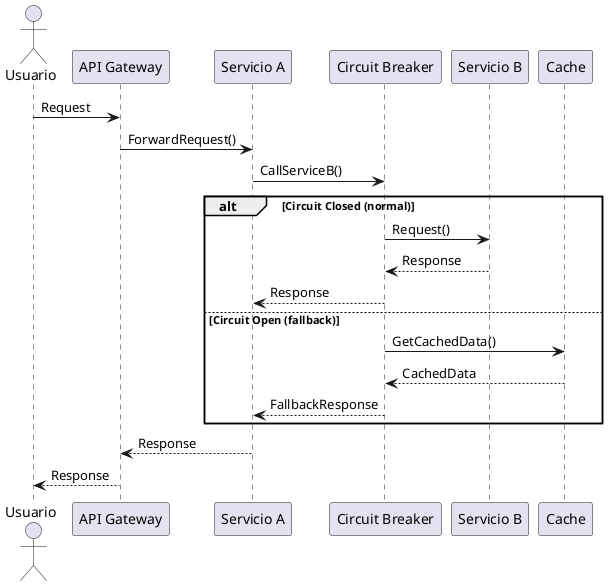

#### 17.3 Modelado con IA y Sistemas Inteligentes

Para sistemas que incorporan IA:

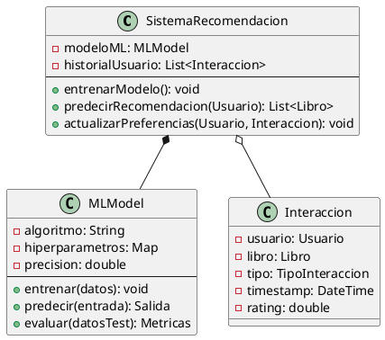


### 18. Apuntes Finales y Próximos Pasos

#### 18.1 Detalle de Conceptos Clave

**Modelado Estático:**
- Captura la **estructura** del sistema
- Diagramas principales: Casos de Uso, Clases, Objetos
- Base para el diseño de bases de datos
- Documento de comunicación entre stakeholders

**Modelado Dinámico:**
- Captura el **comportamiento** del sistema
- Diagramas principales: Secuencia, Comunicación, Actividades, Estados
- Muestra cómo interactúan los componentes
- Fundamental para implementación y testing

**Integración:**
- Ambos enfoques son complementarios
- La trazabilidad asegura consistencia
- Diferentes vistas para diferentes audiencias
- Herramientas CASE facilitan el proceso

#### 18.2 Habilidades Desarrolladas

Al completar este tutorial, han desarrollado capacidad para:

✓ Identificar actores, entidades y relaciones en un dominio
✓ Crear diagramas UML estáticos (casos de uso, clases, objetos)
✓ Crear diagramas UML dinámicos (secuencia, estados, actividades)
✓ Usar PlantUML para documentar sistemas
✓ Mantener consistencia entre diferentes vistas
✓ Transformar modelos conceptuales en esquemas de bases de datos
✓ Documentar procesos de negocio con BPMN
✓ Aplicar buenas prácticas de modelado

#### 18.3 Recursos Adicionales Recomendados

**Libros:**
- "UML Distilled" - Martin Fowler (conciso y práctico)
- "Applying UML and Patterns" - Craig Larman (orientado a objetos)
- "Domain-Driven Design" - Eric Evans (modelado del dominio)

**Herramientas:**
- **PlantUML**: Para diagramas como código
- **Lucidchart**: Herramienta online colaborativa
- **StarUML**: Cliente de escritorio completo
- **Draw.io**: Gratuito y versátil
- **Enterprise Architect**: Profesional (de pago)

**Sitios Web:**
- [PlantUML Official](https://plantuml.com)
- [UML Official Specification - OMG](https://www.omg.org/spec/UML/)
- [Martin Fowler's UML Reference](https://martinfowler.com/bliki/)

#### 18.4 Próximos Temas a Explorar

Con esta base sólida en modelado, están preparados para:

1. **Unidad 6**: Arquitectura de software (Modelo 4+1, microservicios, cloud)
2. **Unidad 7**: Tecnologías emergentes (IA, transformación digital)
3. **Patrones de Diseño**: GoF patterns, patrones arquitectónicos
4. **Testing**: Casos de prueba derivados de diagramas
5. **Implementación**: Traducir modelos a código

#### 18.5 Práctica Continua

El modelado es una habilidad que se perfecciona con la práctica. Recomendaciones:

- Modelen sistemas reales de su entorno (universidad, familia, comunidad)
- Participen en proyectos de código abierto y documenten su arquitectura
- Revisen y critiquen sus propios diagramas regularmente
- Trabajen en equipo y reciban retroalimentación
- Mantengan un portafolio de modelos de diferentes dominios


## Referencias

Este manual fue desarrollado para el curso de Análisis y Desarrollo de Sistemas I de UCATEC, integrando conceptos de:

- UML 2.5 Specification - Object Management Group (OMG)
- "Software Engineering" - Ian Sommerville
- "Systems Analysis and Design" - Dennis, Wixom & Tegarden
- "UML 2 and the Unified Process" - Jim Arlow & Ila Neustadt
- Documentación oficial de PlantUML


**Finalización**

Esperamos que este material les sirva como referencia constante en su formación como Ingenieros de Sistemas. El dominio del análisis y modelado de sistemas es fundamental para su carrera profesional.

¡Éxitos en sus proyectos!

**El Profe Erlanger - UCATEC**
*Cochabamba, Bolivia*